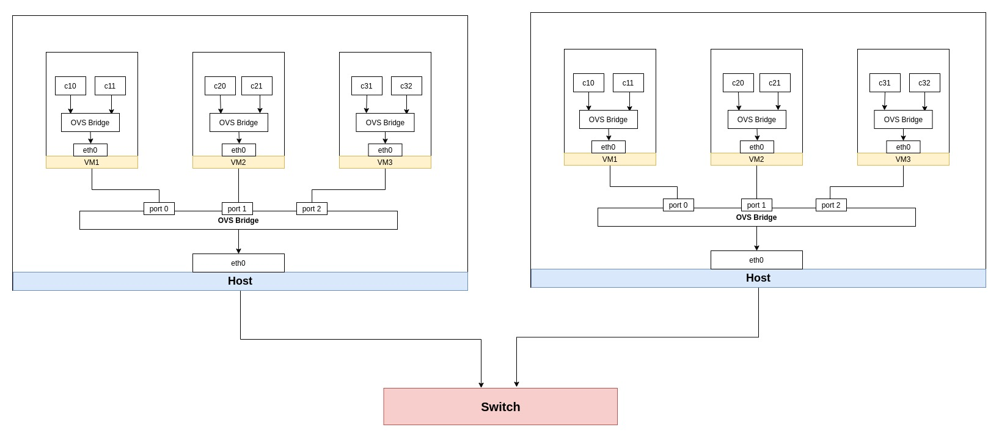

# kubeovs-l2

kubeovs-l2 is a cni plugin to create an underlay network in k8s.

# underlay network design

article: [使用 OVS 打通多节点上的容器通信(Underlay)](https://jiangpengfei.gitbook.io/open-vswitch/jin-jie/shi-yong-ovs-da-tong-duo-jie-dian-shang-de-rong-qi-tong-xin-underlay)